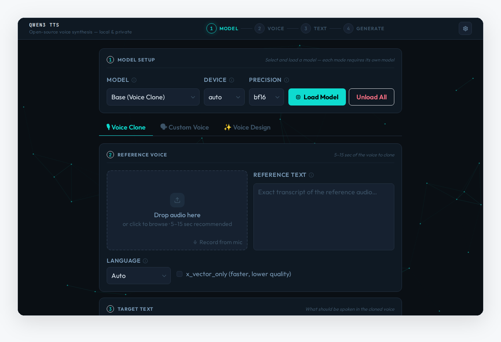
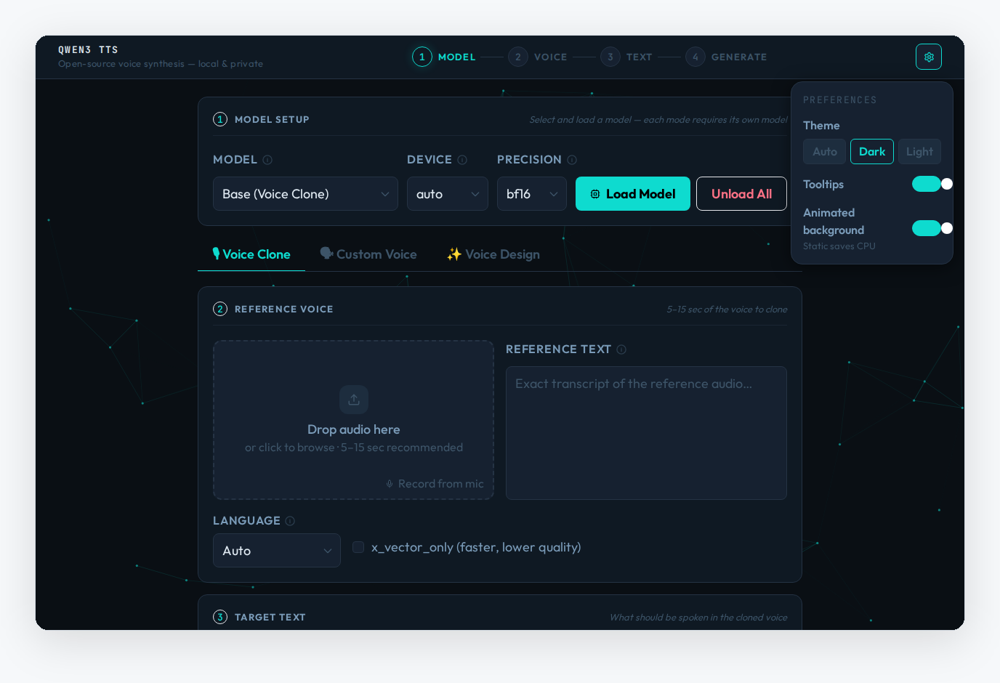
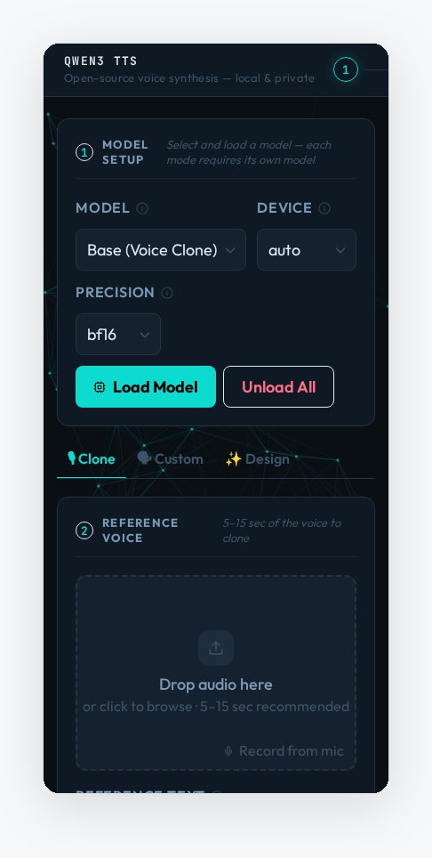

# QWEN3 TTS WebUI

A clean, self-hosted web interface for [Qwen3-TTS](https://huggingface.co/Qwen/Qwen3-TTS-12Hz-1.7B-Base) : local voice synthesis with zero cloud dependency.

Built with **React + Vite + Tailwind** on the frontend and a **FastAPI** backend. Runs in a single Podman/Docker container. Models download automatically from HuggingFace on first use.

<p align="center">
  <picture>
    <source media="(prefers-color-scheme: dark)" srcset="docs/screenshot-desktop-dark.png">
    
  </picture>
</p>

<p align="center">
  <picture>
    <source media="(prefers-color-scheme: dark)" srcset="docs/screenshot-settings-dark.png">
    
  </picture>
  <picture>
    <source media="(prefers-color-scheme: dark)" srcset="docs/screenshot-mobile-dark.png">
    
  </picture>
</p>

---

## Features

- **Three synthesis modes**
  - 🎙 **Voice Clone**: clone any voice from a 5 to 15 sec audio sample
  - 🗣 **Custom Voice**: pick from 9 built-in speakers with optional style direction
  - ✨ **Voice Design**: describe a voice in natural language and generate it
- **Auto-download**: model weights fetch from HuggingFace on first Load Model click
- **ROCm + CUDA**: AMD and NVIDIA GPU support; CPU fallback available
- **Mic recording**: capture reference audio directly in the browser
- **Dark / Light / Auto theme** with animated network background (CPU-free static mode available)
- **Tooltips** on every parameter, toggleable from the settings panel
- Fully mobile-responsive

---

## Requirements

- Podman or Docker
- AMD GPU (ROCm 6.x) **or** NVIDIA GPU (CUDA 12.x); CPU works but is slow
- ~4 GB VRAM per model in bf16 precision; ~8 GB in fp32
- ~3 GB disk space per model variant (up to 9 GB for all three)

---

## Quick start

The commands below are pinned to the current release tag (`v1.0.0`); check the
[Releases page](https://github.com/rodlunt/qwen3-tts-webui/releases) for the latest one.

```bash
git clone --branch v1.0.0 https://github.com/rodlunt/qwen3-tts-webui
cd qwen3-tts-webui

# Build the container (one-time, ~5 min)
podman build -t localhost/qwen3-tts-webui:latest -f Containerfile .

# Run (models download automatically on first Load Model click)
./run.sh

# Or point at an existing model directory
./run.sh /path/to/your/models
```

Open **http://localhost:7860** in your browser.

> **NVIDIA users:** swap the ROCm base image in `Containerfile` for a CUDA-enabled PyTorch image, e.g. `pytorch/pytorch:2.3.0-cuda12.1-cudnn8-runtime`.

---

## Model directory layout

Models live under your chosen directory (default `~/models/qwen3-tts`). The app creates the subdirectory and downloads the weights automatically; nothing to do manually. If you prefer to pre-download:

```bash
huggingface-cli download Qwen/Qwen3-TTS-12Hz-1.7B-Base \
  --local-dir ~/models/qwen3-tts/Qwen3-TTS-12Hz-1.7B-Base
```

Expected layout after all three models are loaded:

```
~/models/qwen3-tts/
  Qwen3-TTS-12Hz-1.7B-Base/         ← Voice Clone
  Qwen3-TTS-12Hz-1.7B-CustomVoice/  ← Custom Voice
  Qwen3-TTS-12Hz-1.7B-VoiceDesign/  ← Voice Design
  hf_cache/                          ← HuggingFace metadata cache
```

---

## Configuration

| Variable | Default | Description |
|---|---|---|
| `QWEN_TTS_MODEL_DIR` | `~/models/qwen3-tts` | Model storage directory |
| `QWEN_TTS_PATH` | (none) | Path to a custom `qwen_tts` package (optional) |

Pass as CLI arg or environment variable:

```bash
# CLI arg
./run.sh /data/models

# Env var
QWEN_TTS_MODEL_DIR=/data/models ./run.sh
```

---

## Development

Run the frontend dev server with hot-module replacement against a local backend:

```bash
# Terminal 1: Python backend
pip install -r api/requirements.txt
python3 api/api.py --model-dir ./models

# Terminal 2: Vite dev server (proxies /api to localhost:7860)
cd frontend && pnpm install && pnpm run dev
```

---

## Contributing and security

Bug reports and feature requests go through [issues](https://github.com/rodlunt/qwen3-tts-webui/issues/new/choose);
see [CONTRIBUTING.md](CONTRIBUTING.md) for dev setup and PR expectations. Security issues go
through [SECURITY.md](SECURITY.md), never a public issue.

---

## Acknowledgements

Built on [Qwen3-TTS](https://huggingface.co/Qwen/Qwen3-TTS-12Hz-1.7B-Base) by Alibaba DAMO Academy, released under Apache 2.0.

---

<sub>Built by [Rodney Lunt](https://rod.lunt.au). If this saved you some time, you can [buy me a coffee](https://buymeacoffee.com/rodlunt).</sub>
